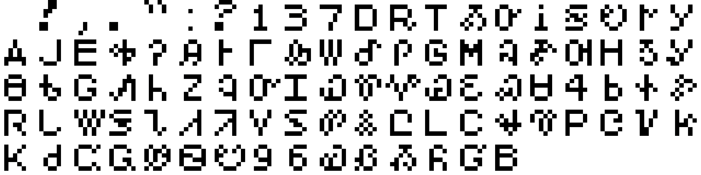
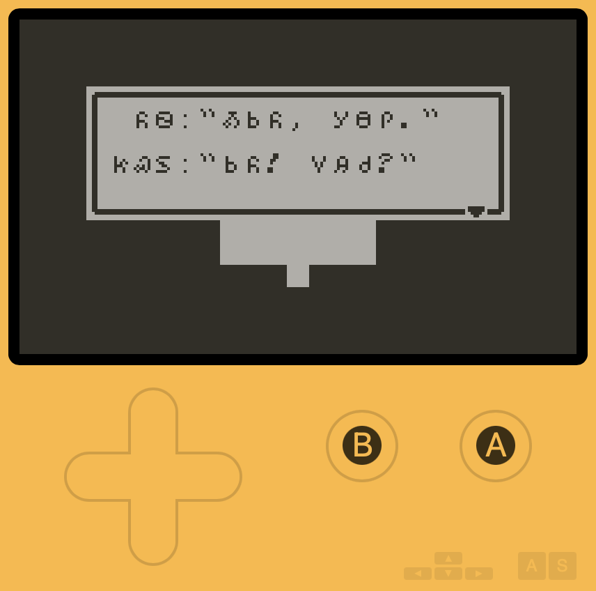
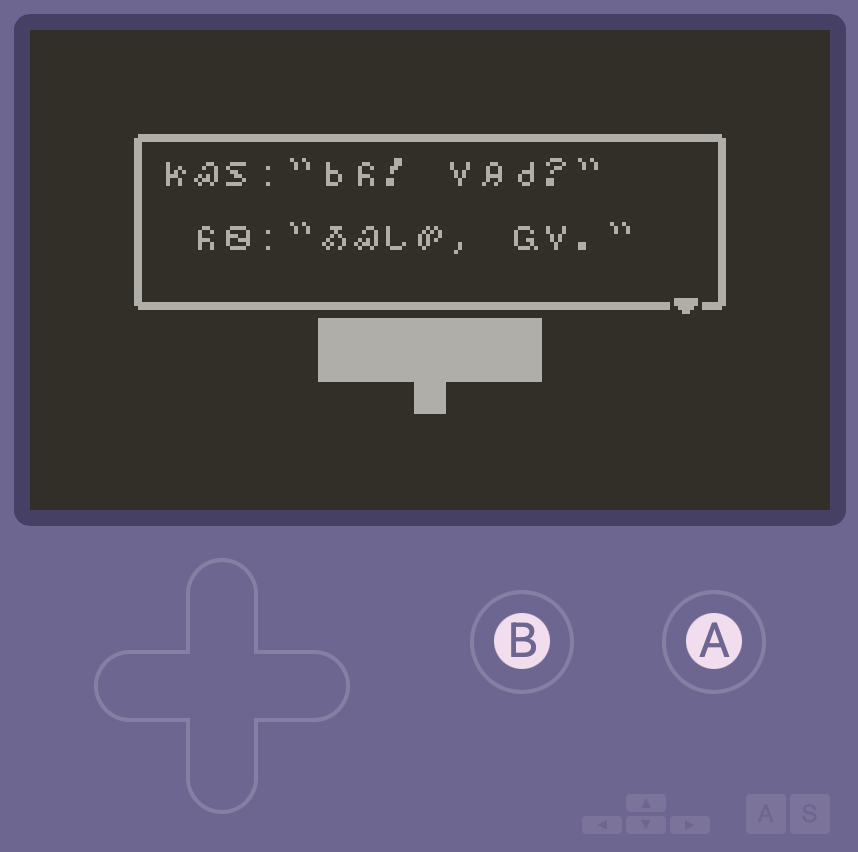

# ᎤᏂᎩᏔ/Unikta 🌱

</img>

ᎤᏂᎩᏔ/Unikta (\/uːniːkʰtʰɑ/ 'seeds') is a Cherokee font and character encoder for [Playdate Pulp](https://play.date/pulp/), a tool that lets users create simple videogames and interactive stories without writing any code which can then be played in a web browser, on a computer, or on a [Playdate](https://play.date).

Pulp is easy to use because of its limitations, but these limitations also include only being able to use the Latin alphabet. ᎤᏂᎩᏔ/Unikta works around this by replacing the stock glyphs with the [Cherokee syllabary](https://en.wikipedia.org/wiki/Cherokee_syllabary), so that while Pulp still sees them as the original letters, numbers, and punctuation, they display as Cherokee syllabary characters instead.

For example, with Unikta loaded into Pulp, typing in `-Y|" +@9!` gives this result:

</img>
 ᎣᏏᏲ, ᎡᎶᎯ! 'Hello World!'

A full chart of how each character is mapped is provided [below](#mapping), but you don't need to worry about mapping to use the font; you can use the [Unikta character encoder](https://morgansleeper.github.io/Unikta/index.html) to type in syllabary and generate text to copy and paste directly into Pulp.

<h3 align = "center"><a href="https://morgansleeper.github.io/Unikta/index.html"><b>Click here to use the character encoder!</a></b></i></h1>

## Using Unikta

- Download `Unikta.png` from this repository
- After starting a new project in Pulp, go to the 'Font' page from the left-hand menu; then click the 'Import' button on top of the font preview and direct it to `Unikta.png`
- Use the [Unikta character encoder](https://morgansleeper.github.io/Unikta/index.html) to type in anything you want to display in syllabary; it will give you text to copy-paste into Pulp for the correct mapping
- ᎰᏪᎸᎦ!

A few notes:

   since there's only space for 95 glyphs in a Pulp font and the Cherokee syllabary takes up 85 of those slots, punctuation is limited to the bare minimum — space, comma, period, exclamation mark, question mark, quotes, and a colon.
   
   most of the numbers from 0-9 are rendered by visual equivalents in the syllabary: Ꮻ _wi_ for '0', Ꮽ _wu_ for '9', etc. The character encoder takes this into account, so you can type in numbers and get the correct equivalent to paste into Pulp.

## Mapping
||||||||||||
|----:|:----|:----|:----|:----|:----|:----|:----|:----|:----|:----|
|ᎤᏂᎩᏔ:|Ꭰ|Ꭱ|Ꭲ|Ꭳ|Ꭴ|Ꭵ|
||a|e|i|o|u|v|
|Pulp:|＊|+|,|-|.|／|
||||||||||||||||||||||
|ᎤᏂᎩᏔ:|Ꭶ|Ꭷ|Ꭸ|Ꭹ|Ꭺ|Ꭻ|Ꭼ|
||ga|ka|ge|gi|go|gu|gv|
|Pulp:|0|1|2|3|4|5|6|
||||||||||||||||||||||
|ᎤᏂᎩᏔ:|Ꭽ|Ꭾ|Ꭿ|Ꮀ|Ꮁ|Ꮂ|
||sa|se|si|so|su|sv|
|Pulp:|7|8|9|:|;|<|
||||||||||||||||||||||
|ᎤᏂᎩᏔ:|Ꮃ|Ꮄ|Ꮅ|Ꮆ|Ꮇ|Ꮈ|
||la|le|li|lo|lu|lv|
|Pulp:|=|>|?|@|A|B|
||||||||||||||||||||||
|ᎤᏂᎩᏔ:|Ꮉ|Ꮊ|Ꮋ|Ꮌ|Ꮍ|
||ma|me|mi|mo|mu|
|Pulp:|C|D|E|F|G|
||||||||||||||||||||||
|ᎤᏂᎩᏔ:|Ꮎ|Ꮏ|Ꮐ|Ꮑ|Ꮒ|Ꮓ|Ꮔ|Ꮕ|
||na|hna|nah|ne|ni|no|nu|nv|
|Pulp:|H|I|J|K|L|M|N|O|
||||||||||||||||||||||
|ᎤᏂᎩᏔ:|Ꮖ|Ꮗ|Ꮘ|Ꮙ|Ꮚ|Ꮛ|
||qua|que|qui|quo|quu|quv|
|Pulp:|P|Q|R|S|T|U|
||||||||||||||||||||||
|ᎤᏂᎩᏔ:|Ꮝ|Ꮜ|Ꮞ|Ꮟ|Ꮠ|Ꮡ|Ꮢ|
||s|sa|se|si|so|su|sv|
|Pulp:|V|W|X|Y|Z|[|/|
||||||||||||||||||||||
|ᎤᏂᎩᏔ:|Ꮣ|Ꮤ|Ꮥ|Ꮦ|Ꮧ|Ꮨ|Ꮩ|Ꮪ|Ꮫ|
||da|ta|de|te|di|ti|do|du|dv|
|Pulp:|]|^|_|`|a|b|c|d|e|
||||||||||||||||||||||
|ᎤᏂᎩᏔ:|Ꮬ|Ꮭ|Ꮮ|Ꮯ|Ꮰ|Ꮱ|Ꮲ|
||dla|tla|tle|tli|tlo|tlu|tlv|
|Pulp:|f|g|h|i|j|k|l|
||||||||||||||||||||||
|ᎤᏂᎩᏔ:|Ꮳ|Ꮴ|Ꮵ|Ꮶ|Ꮷ|Ꮸ|
||tsa|tse|tsi|tso|tsu|tsv|
|Pulp:|m|n|o|p|q|r|
||||||||||||||||||||||
|ᎤᏂᎩᏔ:|Ꮹ|Ꮺ|Ꮻ|Ꮼ|Ꮽ|Ꮾ|
||wa|we|wi|wo|wu|wv|
|Pulp:|s|t|u|v|w|x|
||||||||||||||||||||||
|ᎤᏂᎩᏔ:|Ꮿ|Ᏸ|Ᏹ|Ᏺ|Ᏻ|Ᏼ|
||ya|ye|yi|yo|yu|yv|
|Pulp:|y|z|{|｜|}|~|
||||||||||||||||||||||
||||||||||||||||||||||
|ᎤᏂᎩᏔ:|0|1|2|3|4|5|6|7|8|9|
|Pulp:|u|'|M|(|X|d|x|)|H|w|
||||||||||||||||||||||
||||||||||||||||||||||
|ᎤᏂᎩᏔ:|[ ]|!|,|.|"|:|?|
|Pulp:|[ ]|!|"|#|$|%|&|

## Screenshots

</img>
</img>

## Acknowledgments & extras

Project inspired by weepjp's [Japanese localization test](https://github.com/weepjp/Playdate-Pulp-Sample-jp) of Pulp and its sample game.

Character encoder modeled on r12a's [Pinyin to IPA transcoder](https://github.com/r12a/app-pinyin-phonetics).
